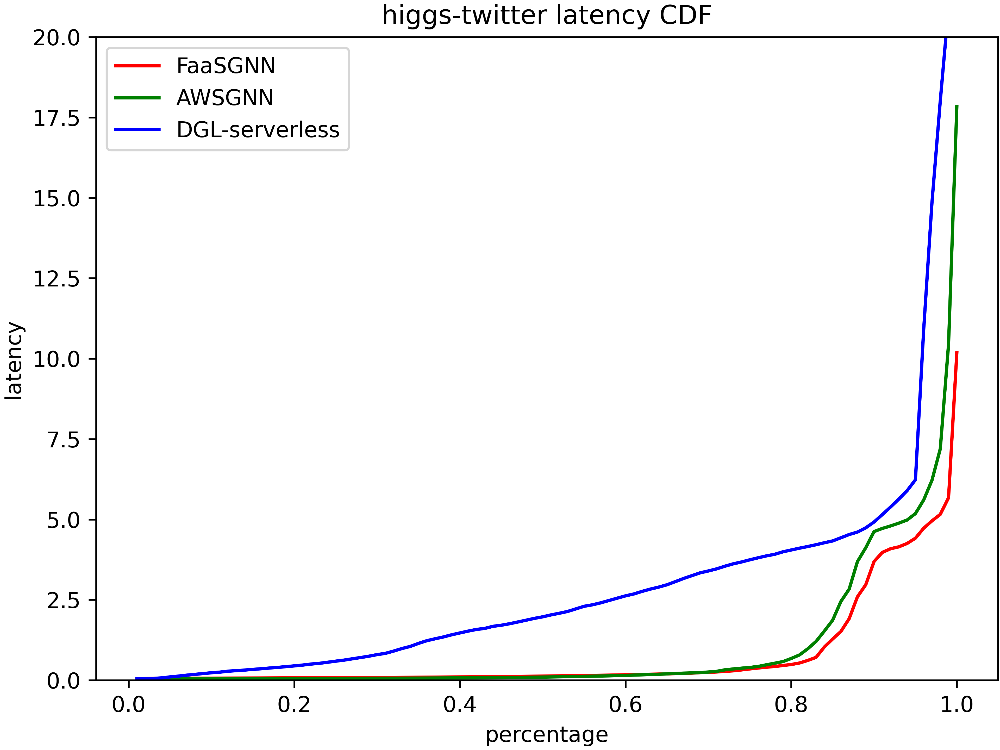

# PPoPP Rebuttal

**Fig. 1: CDF Latency compared of FaaSGNN, AWSGNN and DGL-serverless**

## Q4 for Review B

Fig.1 shows the CDF latency of FaaSGNN, AWSGNN and DGL-serverless, where the y-axis shows the latency of the requests.
Without loss of generality, we show the scenario when model GCN handling requests from the TW dataset. FaaSGNN performs the best for most percentiles of latencies.

